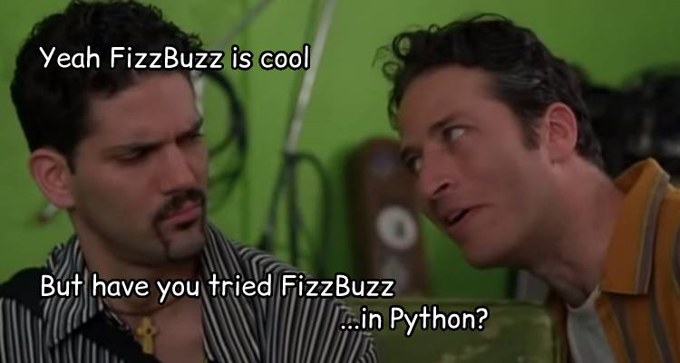

# SEIR 0508 Polyglot Challenge

As you continue on your coding journey, it is critical for you to build up on your ability to learn new things. Remember, the languages and frameworks that we use are constantly updating -  being able to adapt to change is going to be critical for success in this field.

For this activity, lets take a few code challenges that we are familiar with in Javascript, and try them out in our newest language, Python

You should already know the steps required  and the different parts involved for some of these challenges(Looping, conditionals, mathematic operators, string concatination...). What is most important is the ability to translate your existing skills into a new language. 

Because if you can translate your basic JS to Python, you will be able to use these same skills to learn Ruby, Java, Rust, React Native, or any of the other many, many languages and frameworks out there that you will see in when you are working in the field.

For these challenges, you will want to test your code by calling your functions and running  *python3 main.py* in your terminal
