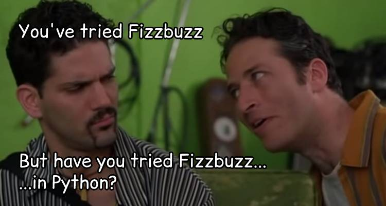

# SEIR 621 Polyglot Challenge

As you continue on your journey studying and working with code, it is critical for you to take your existing skills and build up on your ability to learn new things. Remember, the languages and frameworks that we use are constantly changing - building up your skills and adapting to change is critical for success in this field.

For this activity, lets take a few code challenges that we are familiar with in Javascript, and try them out in our new language, Python

You should already know the steps required for these challenges, and the different parts involved (Looping, conditionals, mathematic operators, string concatination...). What is going to be most important in this is the ability to translate your already existing skills into a new language. 

Because if you can translate your basic JS to Python, you will be able to use these same skills to learn Ruby, Java, Rust, or any of the other many, many languages out there that you will see in the wild.